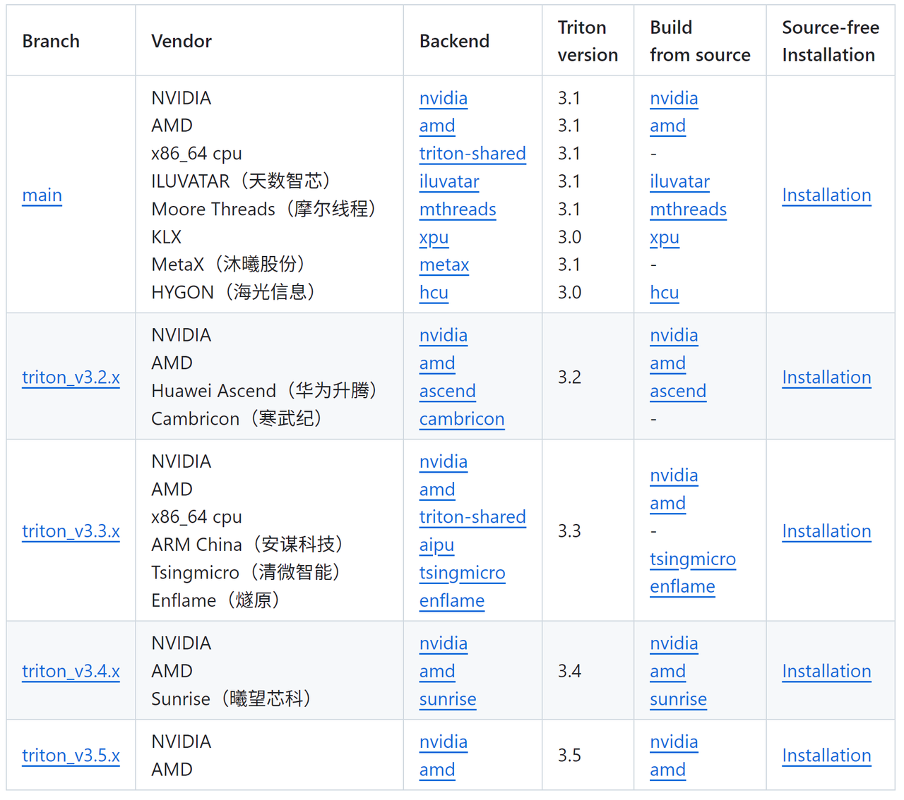
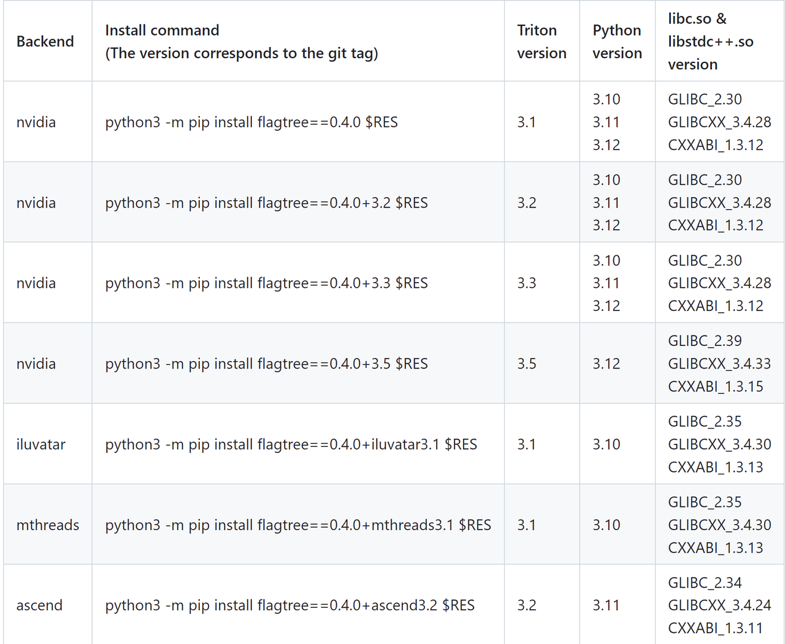

# FlagOS部署指南
本文档用于部署模型推理+FlagGems算子库+FlagTree编译器
## FlagOS PIP包安装
### FlagGems安装
```shell
pip install flag-gems==4.2.1rc0
pip instakll triton==3.5.1
```
### FlagTree安装
https://github.com/flagos-ai/FlagTree
https://github.com/flagos-ai/FlagTree/blob/main/README.md#source-free-installation
Flagtree分支根据后端硬件平台确定


flagtree==0.4.0+3.5代表flagtree0.4.0版本+triton3.5, cuda后端；如果是昇腾应为flagtree==0.4.0+ascend3.2
```shell
pip uninstall triton
pip install flagtree==0.4.0+3.5 --index-url=https://resource.flagos.net/repository/flagos-pypi-hosted/simple --trusted-host=https://resource.flagos.net
```
## FlagOS 源码安装
### FlagGems安装
https://github.com/flagos-ai/FlagGems/blob/master/docs/getting-started.md
```shell
git clone https://github.com/flagos-ai/FlagGems
cd FlagGems && git checkout v4.2.1.rc.0
pip install -U scikit-build-core>=0.11 pybind11 ninja cmake
pip install --no-build-isolation -v .
```
### FlagTree安装
https://github.com/flagos-ai/FlagTree
```shell
git clone https://github.com/flagos-ai/FlagTree
cd FlagTree && git checkout triton_v3.5.x // 分支根据后端硬件平台确定
apt install zlib1g zlib1g-dev libxml2 libxml2-dev  # ubuntu
pip uninstall triton
pip install -r python/requirements.txt
# Set FLAGTREE_BACKEND using the backend name from the table aboveexport FLAGTREE_BACKEND=${backend_name}  # Do not set it on nvidia/amd/triton-sharedcd python  # Need to enter the python directory for Triton 3.1/3.2/3.3
pip install --no-build-isolation -v .  # Install flagtree and uninstall triton
```
## FlagGems算子测试
### 精度测试：
```shell
pytest -s ./tests/算子测试文件::算子名，比如
pytest -s ./tests/test_blas_ops.py::test_accuracy_bmm
```

### 性能测试：
```shell
pytest -s ./benchmark/算子测试文件::算子名,比如
pytest -s ./benchmark/test_norm_perf.py::test_perf_rms_norm
```

## Transformers模型推理+FlagOS
在模型推理脚本开头增加以下代码：
```python
import os
if os.getenv("USE_FLAGOS") == "1":
    import flag_gems
    flag_gems.enable(record=False)
```
使用USE_FLAGOS环境变量开启FlagGems,比如
`USE_FLAGOS=1 python inference.py`
## vLLM模型推理+FlagOS
在vllm/vllm/v1/worker/gpu_model_runner.py开头增加以下代码：
```python
import os
if os.getenv("USE_FLAGOS") == "1":
    import flag_gems
    flag_gems.enable(record=False)
```
使用USE_FLAGOS环境变量开启FlagGems,比如
```shell
USE_FLAGOS=1 vllm serve ${model_path} --dtype auto  --gpu_memory_utilization 0.9 --trust-remote-code --max-num-batched-tokens 16384 --served-model-name qwen --port ${Port}
```
## FlagGems日志与算子控制
开启FlagGems算子日志，记录哪些算子被开启；默认会替换所有的torch aten算子，可以在$path文件中查看
`flag_gems.enable(record=True, once=True, path="./gems.txt")`
Flagems总共有接近300个算子，可以在`FlagGems/src/flag_gems/init.py`中查看所有的算子;实际在大模型推理中，一般只有50多个torch aten算子使用，对应的FlagGems也只有50多个算子被替换；不同的模型启用的算子略有不同
使用`flag_gems.only_enable` API可以单独启用哪些FlagGems算子；使用unused接口可以单独关闭哪些FlagGems算子；没有被开启，或者被关闭的算子，会使用默认的aten cuda算子
### 单独控制开启
```python
FlagGemsEnableConfig=["sort", "sort_stable", "layer_norm"]
flag_gems.only_enable(record=True, once=True, path="./gems.txt", include=FlagGemsEnableConfig)
```

### 单独控制关闭
```python
FlagGemsDisableConfig=["sort", "sort_stable", "layer_norm"]
flag_gems.enable(record=True, once=True, path=f"./gems.txt",unused=FlagGemsDisableConfig)
```
当有些模型推理部署时，会遇到个别FlagGems算子精度存在问题，或者一直在autotune; 这个时候使用算子单独控制开关，可以尽快使模型部署起来
